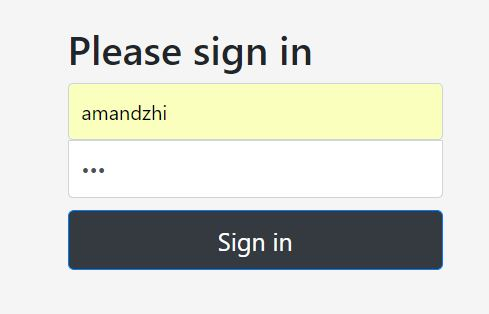
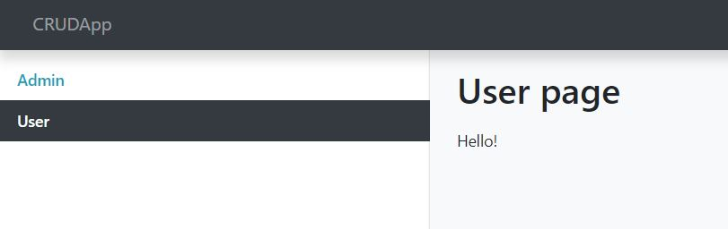
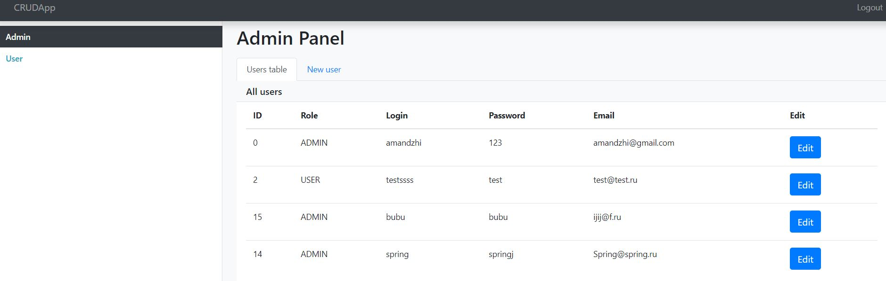
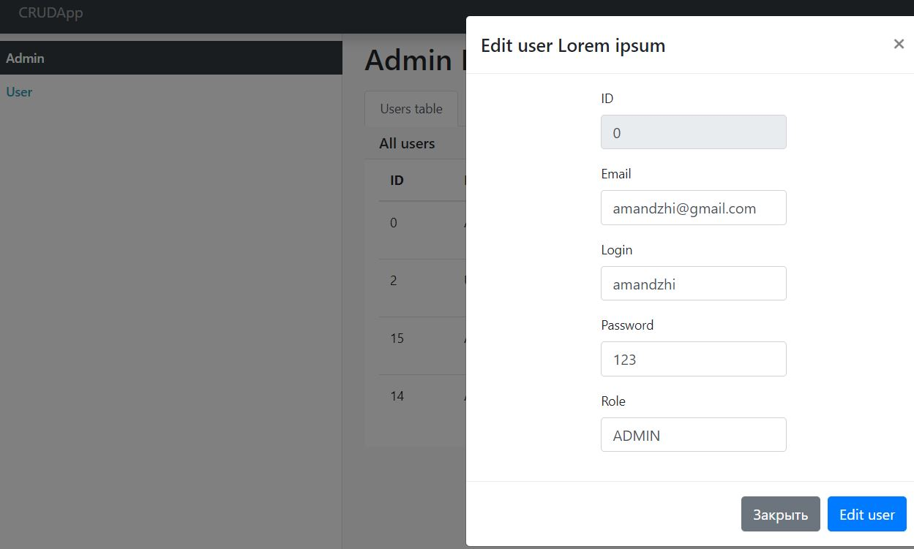
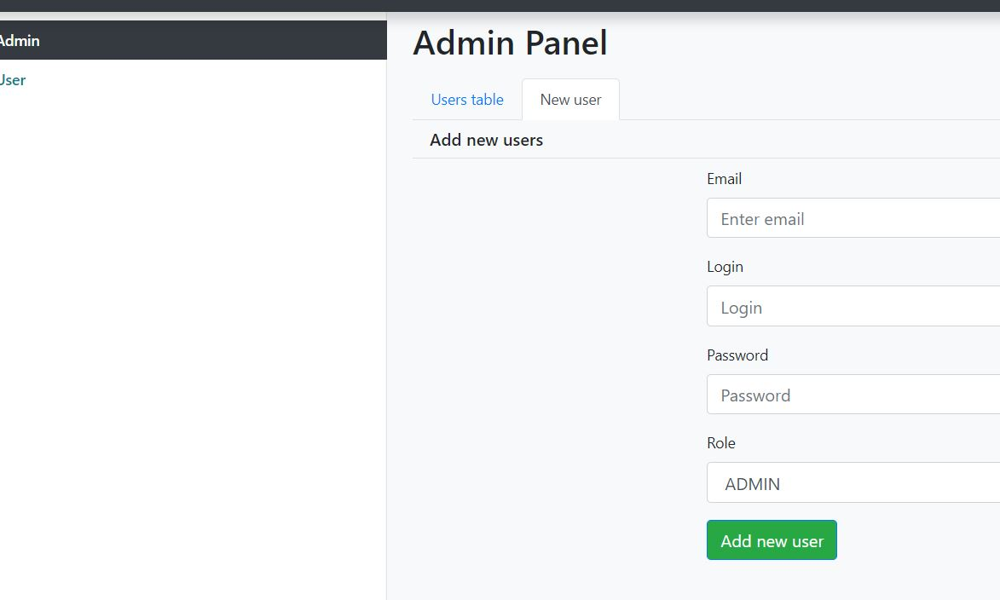

## CRUDApp

В приложении можно создавать, редактировать, получать списки пользователей.

##### Используемые технологии:

+ Maven
+ Spring Boot
+ Spring Data JPA
+ Spring MVC
+ Rest controllers
+ Spring Security Database Authentication
+ MySql
+ Tomcat
+ Bootstrap
+ AJAX

Скриншоты приложения:

Форма логина:

Страница пользователя

Страница администратора

Редактирование пользователя

Заведение нового пользователя

